<div align="center">

```text
██████╗ ██╗ ██████╗  ██████╗ ██╗   ██╗██████╗ 
██╔══██╗██║██╔════╝ ██╔═══██╗██║   ██║██╔══██╗
██████╔╝██║██║  ███╗██║   ██║██║   ██║██████╔╝
██╔══██╗██║██║   ██║██║   ██║██║   ██║██╔══██╗
██║  ██║██║╚██████╔╝╚██████╔╝╚██████╔╝██║  ██║
╚═╝  ╚═╝╚═╝ ╚═════╝  ╚═════╝  ╚═════╝ ╚═╝  ╚═╝
```

### **Stop Vibe Coding. Start Engineering.**

[](https://www.npmjs.com/package/@rigour-labs/cli)
[](https://github.com/erashu212/rigour/actions)
[](https://opensource.org/licenses/MIT)
[](https://www.typescriptlang.org/)

</div>

---

## 🛡️ What is Rigour?

**Rigour** is an open-source, local-first quality gate controller designed specifically for **AI Agentic Workflows**. 

Agents are powerful, but they are chaotic. They hallucinate, they leave `TODO`s, they ignore architectural rules, and they "vibe" their way to broken code. **Rigour forces them to behave.**

It injects a **stateless, deterministic feedback loop** into the agent's lifecycle, ensuring that no task is marked "Done" until it meets strict engineering standards.

### ✨ Key Properties

| Property | Description |
|:---|:---|
| 🔒 **Local-only** | No code leaves your machine. Everything runs on your repo. |
| 🤖 **Agent-agnostic** | Works with any agent because it runs on the repo, not the model. |
| ⚡ **Stateless** | Each check is independent. No session state to manage. |
| 📋 **Deterministic** | Same code = same result. Every time. |

### 🆚 Vibe Coding vs. Rigour Engineering

| Feature | 🚫 Typical AI Agent | 🛡️ Agent with Rigour |
| :--- | :--- | :--- |
| **Definition of Done** | "It looks like it works." | "It passes all static & dynamic gates." |
| **Code Quality** | Spaghetti, rapid prototyping style. | **SOLID**, **DRY**, Modular. |
| **Comments** | `// TODO: Fix this later` | **Forbidden**. Fix it now. |
| **Architecture** | Ignores project structure. | Adheres to `docs/ARCH.md`. |
| **Feedback** | User manually reviewing code. | **Automated Fix Packets** (JSON). |

---

## 🚀 Quick Start

Ensure your project is clean, then initialize Rigour.

```bash
# 1. Initialize Rigour in your project
npx @rigour-labs/cli init

# 2. That's it. Your agent now knows the rules.
```

### ⚡ The "Run Loop" (Recommended)

Don't just run Claude or Gemini. Run them **with Rigour**.

```bash
# Wraps the agent command in a self-healing quality loop
npx @rigour-labs/cli run -- claude "Refactor the auth middleware"
```

#### 🔄 The Run Loop Contract

```
rigour run -- <agent-command>

1. Execute your agent command
2. Run `rigour check` automatically
3. If FAIL → Generate Fix Packet and print to stdout
4. Re-run agent with Fix Packet context
5. Repeat until PASS or max cycles (default: 3)
```

| Option | Default | Description |
|:---|:---:|:---|
| `--iterations` | 3 | Maximum loop cycles before failing |

---

## 🏗️ Architecture

Rigour acts as the **Supervisor** between the Agent and the Filesystem.

```mermaid
sequenceDiagram
    participant User
    participant Agent
    participant Rigour
    participant Codebase

    User->>Agent: "Build this feature"
    loop Rigour Cycle
        Agent->>Codebase: Write Code
        Agent->>Rigour: Run specific checks?
        Rigour->>Codebase: Scan files
        Rigour->>Rigour: Verify Gates (Size, TODOs, Lint)
        alt Quality Check PASS
            Rigour-->>Agent: ✅ PASS
        else Quality Check FAIL
            Rigour-->>Agent: 🛑 FAIL (Violations Found)
            Rigour-->>Agent: 📋 Fix Packet (Prioritized Tasks)
            Agent->>Codebase: Refactor & Fix
        end
    end
    Agent->>User: "Task Verified & Complete"
```



---

## 🧩 Quality Gates

Rigour comes with built-in "Engineering Primitives" that you can configure in `rigour.yml`.

```mermaid
flowchart LR
    subgraph Internal Gates
        A[📏 File Size] --> B{Lines > 500?}
        B -- Yes --> C[🛑 FAIL]
        B -- No --> D[✅ PASS]
        
        E[🧹 Hygiene] --> F{TODO/FIXME?}
        F -- Found --> G[🛑 FAIL]
        F -- Clean --> H[✅ PASS]
        
        I[📁 Structure] --> J{Required docs exist?}
        J -- Missing --> K[🛑 FAIL]
        J -- Present --> L[✅ PASS]
    end
    
    subgraph Command Gates
        M[🔧 Lint] --> N[npm run lint]
        O[🧪 Test] --> P[npm test]
        Q[📝 TypeCheck] --> R[tsc --noEmit]
    end
```



| Primitive | Description | Default Strictness |
| :--- | :--- | :--- |
| **Structure** | Enforces max file size (e.g., 500 lines). | **High** (SRP enforcement) |
| **Hygiene** | Bans `TODO`, `FIXME`, and leaked secrets. | **Total** (Zero tolerance) |
| **Determinism** | Runs `tsc`, `eslint`, or `vitest`. | **Configurable** |
| **Documentation** | Ensures critical docs exist. | **Medium** |

---

## 🧠 Memory Preservation

Agents often forget context between sessions. Rigour enforces **Project Memory** by requiring documentation files:

```mermaid
flowchart TD
    subgraph Required Memory Files
        SPEC[docs/SPEC.md<br/>Project Specification]
        ARCH[docs/ARCH.md<br/>Architecture Decisions]
        DEC[docs/DECISIONS.md<br/>Design Rationale]
        TASK[docs/TASKS.md<br/>Task Tracking]
    end
    
    INIT[rigour init] --> SPEC
    INIT --> ARCH
    INIT --> DEC
    INIT --> TASK
    
    CHECK[rigour check] --> VERIFY{All files exist?}
    VERIFY -- No --> FAIL[🛑 FAIL<br/>Memory Loss Detected]
    VERIFY -- Yes --> PASS[✅ PASS<br/>Memory Preserved]
```



---

## 📦 Package Architecture


## 🤖 Agent Integration

Rigour integrates with all major AI coding tools via **CLI**, **MCP**, or **Universal Handshake**.

### 📋 Agent Compatibility

| Tool | Integration | Automation | Notes |
|:---|:---|:---:|:---|
| **Cursor** | Rules + MCP | ⭐⭐⭐ | Native handshake via `.cursor/rules` |
| **Claude Desktop** | MCP Server | ⭐⭐⭐ | Full tool support |
| **VS Code Cline** | MCP Server | ⭐⭐⭐ | Full tool support |
| **Claude Code CLI** | `rigour run` | ⭐⭐⭐⭐ | Best for automation |
| **Gemini CLI** | `rigour run` | ⭐⭐⭐ | Best-effort |
| **Codex CLI** | `rigour run` | ⭐⭐⭐ | Good |

### 📝 Universal Agent Handshake

Rigour writes protocol files that any sophisticated agent can read:

```bash
npx @rigour-labs/cli init
```

**Files created:**
- `.cursor/rules/rigour.mdc`: Native enforcement for Cursor
- `docs/AGENT_INSTRUCTIONS.md`: Universal protocol for any agent

Agents read these files and know to run `npx @rigour-labs/cli check` before claiming "Done".

### 💻 Claude Code CLI

Use the `run` wrapper to create a self-healing loop:

```bash
npx @rigour-labs/cli run -- claude "Refactor the payment service"
```

### ♊ Gemini CLI

```bash
npx @rigour-labs/cli run -- gemini "Add error handling to the API layer"
```

### 🧠 Codex / OpenAI CLI

```bash
npx @rigour-labs/cli run -- codex "Implement the user authentication flow"
```

---

## 🔌 MCP Integration (Model Context Protocol)

For agents that support MCP (Claude Desktop, VS Code Cline, etc.), Rigour exposes tools directly.

### Claude Desktop

Add to your `claude_desktop_config.json`:

```json
{
  "mcpServers": {
    "rigour": {
      "command": "npx",
      "args": ["-y", "@rigour-labs/mcp"]
    }
  }
}
```

### VS Code Cline

Add to your Cline MCP settings:

```json
{
  "mcpServers": {
    "rigour": {
      "command": "npx",
      "args": ["-y", "@rigour-labs/mcp"]
    }
  }
}
```

### Available MCP Tools

| Tool | Description |
|:---|:---|
| `rigour_check_status` | Returns PASS/FAIL and a summary of all gate results. |
| `rigour_get_fix_packet` | Returns prioritized, actionable fix instructions for failures. |

The agent should call `rigour_check_status` before claiming task completion. If it fails, call `rigour_get_fix_packet` and iterate.

---

## 📜 License

MIT © [Rigour Labs](https://github.com/erashu212). 

> **"Software Engineering is what happens to programming when you add time and other programmers."** — Russ Cox. 
>
> Rigour adds the engineering.
